# OpenV2X hippocampus

OpenV2X Video Perception Module, it supports Video Object Detection (VID) and Multiple Object
Tracking (MOT)

[Quick Start](docs/1-How-to-develop.md)

## Archtecture

Design archetecture:

